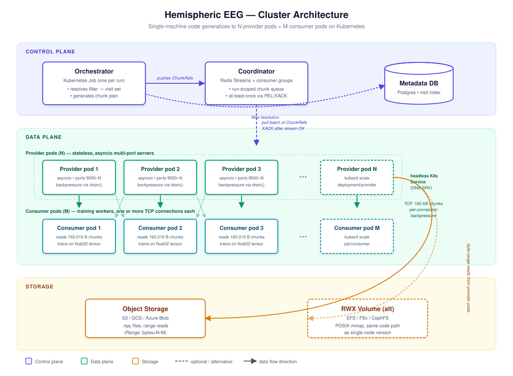

# Architecture: Scaling to a Cluster

This document describes how the single-machine orchestrator and provider in this repository would evolve to run as a distributed system, and the design choices behind it. None of this is implemented in the current codebase. The current code is the single-node version that this design generalizes from.

## What the single-node version already does right

Three properties of the current code carry over to the cluster version with no rework:

1. **Chunk planning is metadata-only.** The plan is a list of pointers (`ChunkRef`), not bytes. We can build, shuffle, and shard millions of them cheaply, and we can partition them across nodes without moving any EEG data.

2. **The wire protocol is fixed-size and stateless.** Each chunk on the socket is 160,016 bytes and self-describes via its UUID prefix. The consumer doesn't need a session, a handshake, or sequence numbers. This makes consumers indifferent to which provider node they're talking to.

3. **Backpressure is per-connection.** TCP plus `writer.drain()` already throttles the producer to the consumer. In a cluster this remains true on each provider-to-consumer link, with no global coordination required.

## Three independent layers of concurrency (this is the important framing)

The cluster design has three distinct things that all get called "concurrency" and "scaling," and it's worth separating them up front because they're often confused:

| Layer | Purpose | Tool we use |
|---|---|---|
| Cross-node work distribution | Splitting the chunk plan across many machines | **Kubernetes** Job + **Redis Streams** as the queue |
| Per-pod TCP I/O concurrency | One provider pod serving many consumer connections | **asyncio** |
| Within-chunk byte handling | Reading 160 KB from disk, writing to a socket | Plain Python + numpy mmap |

These are complementary, not alternatives. asyncio replaces threads at the per-pod level; Kubernetes + Redis replaces nothing on a single node but adds horizontal scaling. The training team's actual question of "how do I run this across 50 machines" is answered by the top row, not by switching away from asyncio.

The reason I picked asyncio for the per-pod TCP serving (rather than threads or processes per port): asyncio is cheap I/O concurrency on one thread, with `writer.drain()` giving us free backpressure. Threads would work but cost an OS-managed stack per port and need locks for shared state. Multi-process would work but pay full IPC overhead. For pure socket-pushing-bytes work, asyncio is the right shape. None of that changes when we move to a cluster; we just have N pods each running asyncio internally.

## The cluster topology



Five components, each independently scaled.

### 1. Orchestrator: a Kubernetes Job

The orchestrator becomes a one-shot Job that:

- Parses CLI filter flags and resolves the matching visit set against the metadata DB.
- Generates a unique `run_id` and a global shuffled chunk plan (still cheap, still pointers).
- Pushes that plan into the coordinator as a work queue.
- Templates and applies a `Provider` Deployment of N pods and a `Consumer` Job of M pods.
- Watches both to completion, surfaces logs, exits.

Same CLI surface as the single-node version, just different effects. Filter, port count, and consumer image become Helm values or Job env vars.

### 2. Coordinator: a work queue

Holds the run-scoped chunk plan as an ordered queue keyed by `run_id`. Provider pods pull batches of chunk references from it; the queue tracks which references are in flight and which have been ack'd.

**Implementation options.** Redis Streams with consumer groups handles this natively (XREADGROUP, XACK), survives provider crashes (PEL replay), and scales to millions of entries on a single instance. NATS JetStream is a fine alternative with stronger durability guarantees. For lower scale, a Postgres table with `SELECT ... FOR UPDATE SKIP LOCKED` is the boring sufficient answer.

The shuffled order is preserved by the queue's FIFO discipline. We get global randomness and at-least-once delivery (which is fine because EEG chunks are idempotent: seeing a chunk twice during training is at worst minor overrepresentation).

### 3. Provider pods: stateless workers

Each provider pod:

- Listens on a fixed port (say 9000) and is exposed via a headless Kubernetes Service so consumers can reach individual pods by DNS.
- Pulls a small batch of `ChunkRef`s from the coordinator (say 16 at a time, tunable for latency vs. throughput).
- Reads the bytes from object storage or a `ReadWriteMany` volume mount.
- Streams them to whichever consumer is currently connected, in the order they were pulled.
- ACKs the batch back to the coordinator.

Provider pods are stateless and interchangeable. Scaling is a `kubectl scale deployment` away. They die-and-restart cleanly because all state lives in the coordinator and storage.

**Storage.** Two viable options:

- **Object storage (S3, GCS, Azure Blob).** Best fit when raw EEG files are large and access is occasional per file. Provider pods stream byte-range requests against the `.npy` files. Since `.npy` has a known header followed by contiguous float32 rows, we can compute the byte offset of any 10-second window analytically (`header_offset + sample_start * 4_channels * 4_bytes`) and issue a `Range: bytes=` header for exactly 160 KB. No need to download the whole 19 MB file just to serve one chunk.
- **ReadWriteMany volume (EFS, FSx, CephFS).** Better when the working set is small enough to live behind a POSIX cache and you want page-cache locality. Same `np.load(path, mmap_mode='r')` code as the single-node version, just on a mounted volume.

A 1-2 GB local SSD on each provider pod as an LRU cache for hot files makes either backend much faster.

### 4. Consumer pods: the training process

Each consumer pod:

- Resolves the provider Service to a list of pod IPs via DNS SRV records or the K8s API.
- Opens TCP connections to a configurable subset (e.g., one provider per data-loader worker).
- Reads 160,016-byte chunks just like the single-node version.

The current `protocol.parse_chunk()` and `consumer.run_consumer()` ports straight over with one change: the host list is dynamic, resolved from K8s rather than passed via CLI.

When a provider pod runs out of work and closes a connection, the consumer reconnects to a different provider. Eventually the queue is empty, every provider closes its sockets, and consumers see clean EOF on every connection. The training loop ends.

### 5. Metadata DB

A small Postgres table keyed by `visit_id` with the JSON record's fields plus the storage URL of the EEG file. The orchestrator queries it for filter resolution. This replaces the file-system scan in `metadata.iter_visits`. A 100K-visit table is trivial; we'd index `gender`, `age`, and any other commonly-filtered fields.

## Failure handling

| Failure | Recovery |
|---|---|
| Provider pod crashes mid-stream | Coordinator's PEL holds unack'd refs; another pod picks them up. Consumer sees its TCP connection drop, reconnects to a different pod. |
| Consumer pod crashes | Provider's `writer.drain()` raises `ConnectionResetError`. Provider returns its in-flight batch to the queue (NACK), pulls the next batch for whichever consumer reconnects. |
| Coordinator unavailable | Providers stall on `XREADGROUP`. Existing connections continue draining their already-pulled batches. New consumer connections wait. Standard Redis/NATS HA mitigates. |
| Storage backend slow | Backpressure is automatic: provider's `read()` blocks, `writer.drain()` doesn't fire, consumers wait. No queue overflow. |
| Slow consumer | Per-connection backpressure; doesn't affect other consumers. |

## What the cluster version does *not* try to do

- **Strict global ordering.** Per-consumer ordering is what training cares about. We give each consumer a steady stream of randomized chunks; whether two consumers see chunk X in the same wall-clock slot is irrelevant.
- **Exactly-once delivery.** At-least-once is fine for training. The cost of dedup machinery exceeds the benefit of avoiding occasional repeats.
- **End-to-end encryption.** Assumed to be handled by the network layer (mTLS via service mesh, or VPC isolation).

## Where this current repo would change

Concretely, to go from the current code to the cluster version:

| Module | Change |
|---|---|
| `cli.py` | Add `--cluster` flag. In cluster mode, push the chunk plan to the coordinator and apply K8s manifests instead of running provider/consumer in-process. |
| `provider.py` | Pulls `ChunkRef` batches from a `CoordinatorClient` instead of receiving a static `shards` list. Reads bytes from a `Storage` interface (S3 or volume) instead of a local `np.load` mmap. |
| `metadata.py` | Add a `MetadataDB` backend alongside the file-system loader. Keep the file-system loader for development. |
| `chunking.py` | Unchanged. |
| `protocol.py` | Unchanged. |
| `consumer.py` | Resolves host list from K8s service discovery. Reconnects on EOF until all providers close. |

The `ChunkRef`, the wire protocol, and the chunking logic are reused as-is. That's the payoff of keeping plan and bytes separate: the same primitives describe a single laptop and a thousand-pod cluster.

## Scaling commands (what the operator actually does)

Three dials to turn, each independently:

**More provider pods (horizontal data-path scaling).** If chunk throughput is the bottleneck, add provider replicas. Each new pod registers with the coordinator and starts pulling work.

```bash
kubectl scale deployment/provider --replicas=20
```

Linear scaling because pods are stateless and pull from a shared queue. The only ceiling is storage backend bandwidth (S3 limits per bucket, EFS throughput for a volume).

**More consumer workers (horizontal training-side scaling).** If the training side is the bottleneck (GPUs underutilized waiting for chunks), scale up consumer workers. Each one opens its own TCP connections to provider pods.

```bash
kubectl scale job/consumer --parallelism=8
```

The provider side absorbs this for free because of the existing per-connection backpressure: more consumers means more connections, not coordination overhead.

**More ports per provider (vertical per-pod scaling).** If a single pod has CPU/network headroom and you want to reduce pod count, give each pod more ports. This is the `--ports` flag.

```bash
python run_training.py --ports 5000 5001 5002 5003 5004 5005 5006 5007
```

asyncio's job is to multiplex these N ports on one event loop without paying for one thread per port. Inside one pod, 8 ports cost roughly the same as 2 because the work is I/O-bound.

## Concrete tool choices (and why)

The architecture section above named some tools by category. The actual choice for each, with rationale:

| Decision | Pick | Why |
|---|---|---|
| Cluster orchestrator | **Kubernetes Jobs** | Standard, the deep-learning team likely already runs on it, Helm charts and Argo CD make rollout boring |
| Work queue | **Redis Streams** with consumer groups | Built-in at-least-once delivery via PEL, replay on consumer crash, single Redis instance handles millions of entries, common dependency that's easy to operate |
| Alternative queue | NATS JetStream | More throughput than Redis Streams if you outgrow it; stronger durability guarantees |
| Alternative queue | Postgres with `SELECT ... FOR UPDATE SKIP LOCKED` | Boring sufficient answer for low scale; you probably already have Postgres |
| Storage | **S3 / GCS / Azure Blob** for raw `.npy` | Cheap, durable, byte-range requests fit our chunk-level access pattern. `.npy` headers are tiny so `HEAD` + `GET` with `Range: bytes=N-M` gets one chunk without downloading the whole file |
| Alternative storage | ReadWriteMany volume (EFS, FSx, CephFS) | Better when working set fits in page cache and you want POSIX |
| Metadata DB | **Postgres** | One table keyed by visit_id, indexed on filterable fields. 100K rows is trivial; 100M rows still fits in one box |
| Service discovery | Kubernetes headless Service | DNS A records per pod; consumers do their own connection management |
| Why not Airflow / Argo Workflows? | Overkill | We don't have multi-step DAG dependencies; a K8s Job is enough |
| Why not Celery? | Overkill | Celery is for task queues with retries, scheduling, dependencies. We need a single durable work queue, not a workflow engine |

The general principle: prefer boring infrastructure that the team already operates. Adding a new system to your operational footprint should be earned by a clear performance or reliability benefit, not by "it's the trendy choice for ML."
